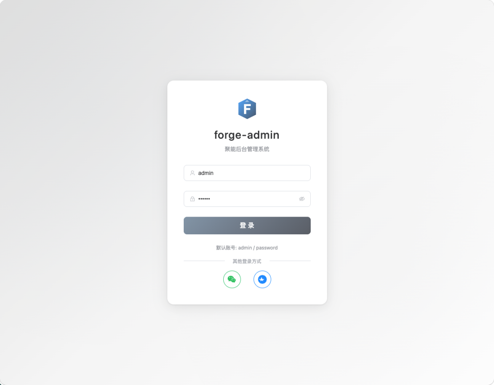
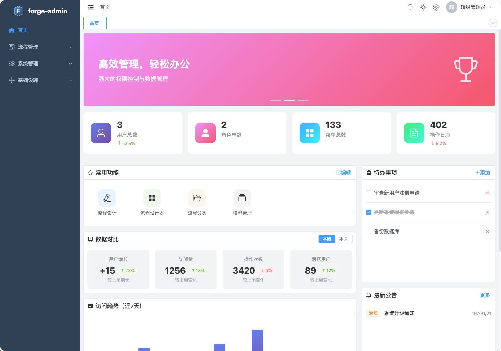
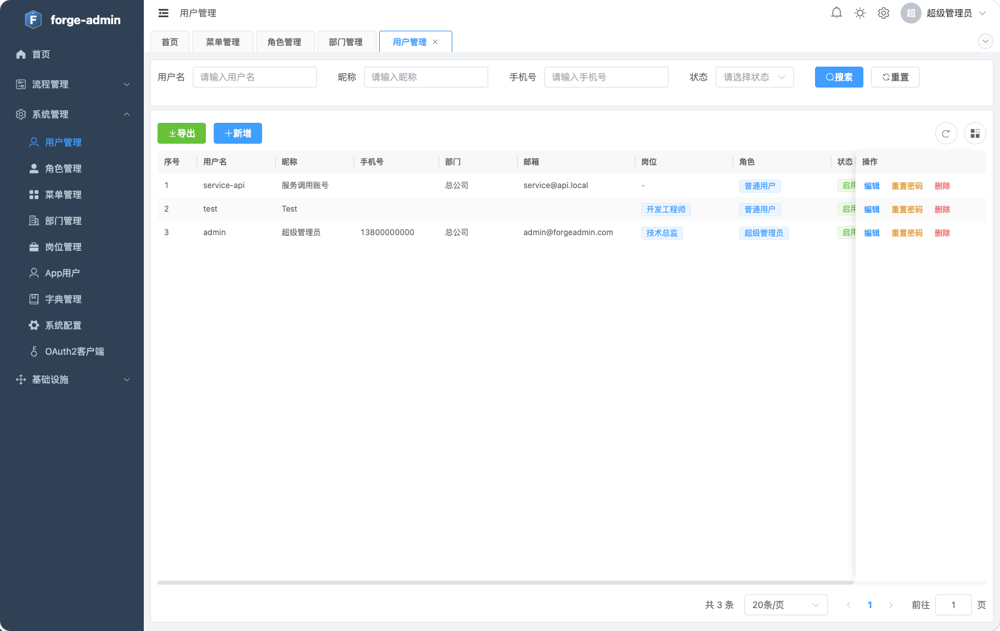
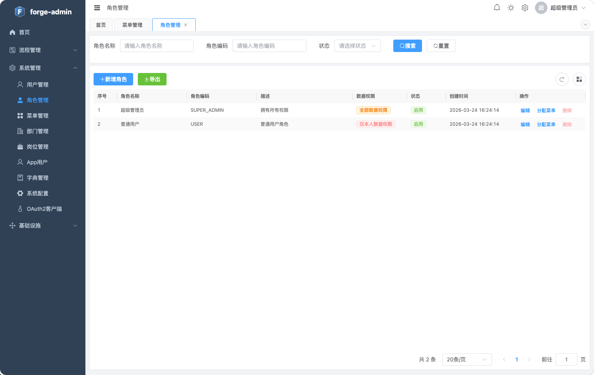
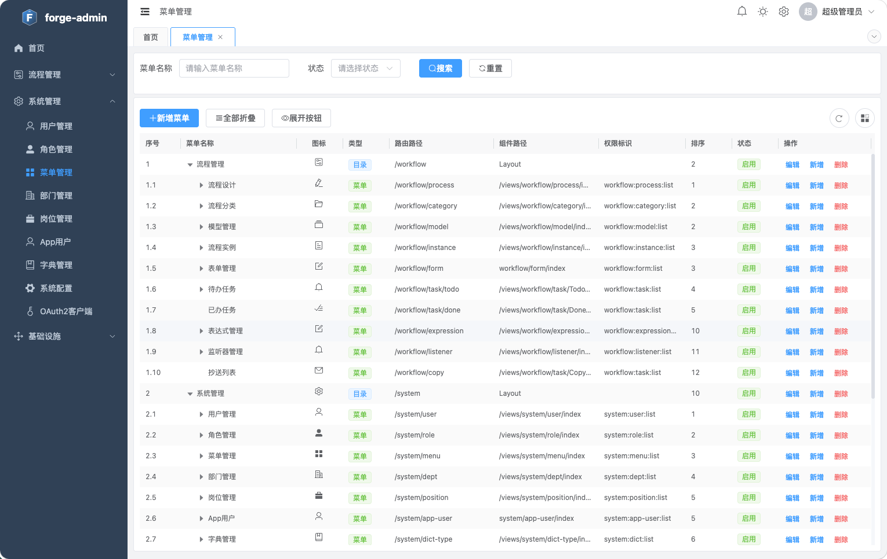
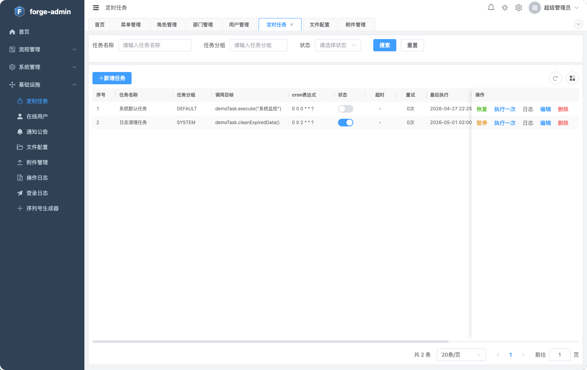

# forge-admin

企业级后台管理系统模板，基于 RBAC（基于角色的访问控制）权限模型，前后端分离，开箱即用。

## 项目简介

forge-admin 是一款现代化的企业级后台管理解决方案，采用前后端分离架构设计。后端基于 Spring Boot 3.2 构建，采用多模块 Maven 项目结构，使用 MyBatis Plus 简化数据操作，JWT 实现无状态认证；前端采用 Vue 3 + TypeScript + Element Plus + vxe-table 技术栈，提供流畅的用户体验、完善的类型支持和强大的表格功能。

系统内置完整的权限管理模块，支持用户、角色、菜单、部门的层级管理，并实现细粒度的数据权限控制（全部/本部门/本部门及以下/仅本人）。集成 OAuth2 授权服务器（基于 Spring Authorization Server），支持微信、钉钉等第三方登录（基于 JustAuth），允许第三方应用通过本系统进行用户认证。此外还集成了 Quartz 定时任务调度、在线 API 文档（Knife4j）、操作日志审计、登录日志等企业级功能。支持 Docker 容器化部署，提供项目模板化工具，可快速基于此项目创建新的管理系统。

## 项目截图

### 登录页面



### 仪表盘



### 用户管理



### 角色管理



### 菜单管理



### 定时任务




## 功能清单

### 系统管理

| 功能 | 说明 |
|------|------|
| 用户管理 | 用户增删改查、状态控制、密码重置、部门关联、岗位分配 |
| 角色管理 | 角色增删改查、菜单权限分配、数据权限设置 |
| 菜单管理 | 菜单增删改查、路由配置、权限标识、图标设置 |
| 部门管理 | 部门树形结构、增删改查、负责人设置 |
| 岗位管理 | 岗位增删改查、状态控制 |
| 字典管理 | 字典类型和数据管理、缓存刷新 |
| 参数配置 | 系统参数增删改查、缓存刷新 |
| 文件配置 | 文件存储配置（本地/OSS） |
| 通知公告 | 公告增删改查、发布状态管理 |
| 在线用户 | 查看在线用户、强制下线 |

### 监控中心

| 功能 | 说明 |
|------|------|
| 登录日志 | 登录记录查询、状态统计 |
| 操作日志 | 操作记录查询、审计追踪 |
| 定时任务 | 任务增删改查、执行控制、日志查看 |
| 服务监控 | 服务器状态、JVM 信息、Redis 监控 |

### 流程管理

| 功能 | 说明 |
|------|------|
| 模型管理 | 流程模型设计（FlowLong可视化设计器）、模型部署、版本管理 |
| 审批流程 | 已部署流程查看、启用/停用、版本切换 |
| 表单管理 | 表单设计（可视化拖拽）、表单配置 |
| 流程分类 | 分类树形结构、增删改查 |
| 流程实例 | 实例查询、详情查看、取消流程 |
| 待办任务 | 待办列表、审批操作（通过/驳回/委派/转办/退回/加签） |
| 已办任务 | 已办列表、审批记录查看 |
| 抄送列表 | 抄送记录查看 |
| 表达式管理 | 流程表达式增删改查 |
| 监听器管理 | 流程监听器增删改查 |

### AI 功能

| 功能 | 说明 |
|------|------|
| AI 文档管理 | 文档上传、智能摘要生成、对话问答 |
| 多模型对话 | 支持 DeepSeek、Qwen、GLM、ERNIE 等模型 |
| 文档解析 | PDF、DOCX、TXT 文档解析 |
| 流式响应 | SSE 实时流式输出 |

### 移动端（小程序）

| 功能 | 说明 |
|------|------|
| 微信授权登录 | 一键授权、自动注册 |
| 个人中心 | 信息编辑、头像修改、手机绑定 |
| 账号注销 | 用户账号注销 |

### 系统工具

| 功能 | 说明 |
|------|------|
| 项目模板化 | 基于模板创建新项目 |
| 模块管理 | 创建/删除业务模块 |
| API 文档 | Knife4j 在线文档 |

## 特性

- **权限管理**：完整的 RBAC 权限系统，支持用户、角色、菜单、部门管理
- **数据权限**：支持部门数据权限隔离（5 种范围类型）
- **OAuth2 授权服务器**：基于 Spring Authorization Server，支持授权码、客户端凭证等标准 OAuth2/OIDC 协议
- **第三方登录**：支持微信、钉钉扫码登录，基于 JustAuth 实现
- **工作流引擎**：集成 FlowLong 国产工作流引擎，支持流程设计、审批管理、待办任务、流程实例监控
- **字典管理**：灵活的数据字典配置，支持缓存刷新
- **定时任务**：基于 Quartz 的定时任务管理和日志
- **文件存储**：支持本地存储，可扩展 OSS 等
- **AI 功能**：集成 Python AI 服务，支持多模型对话、文档解析、智能摘要
- **API 文档**：集成 Knife4j，提供在线 API 文档
- **移动端支持**：独立的 `/app-api` 端点，支持微信小程序授权登录
- **强大表格**：vxe-table 提供列自定义、导出、打印等功能
- **等保二级合规**：符合 GB/T 22239-2019 二级等保要求的安全改造
  - **密码安全**：复杂度校验（8-32位、大小写+数字+特殊字符）、历史校验（5条不可重复）、90天有效期、首次登录强制改密、BCrypt 强度=12
  - **登录安全**：失败锁定（5次→15分钟）、图形验证码、单点登录（踢掉旧会话+refreshToken 同步失效）
  - **数据加密**：AES-256-GCM 敏感字段加密（phone/email）、jasypt 配置文件加密
  - **应用安全**：XSS 过滤器、安全响应头（CSP/HSTS/X-Frame-Options 等）、文件上传校验（扩展名+Magic Number）
  - **审计安全**：操作日志敏感字段自动脱敏（密码/手机号/邮箱/身份证）

## 技术栈

### 后端

- Java 21
- Spring Boot 3.2.0
- MyBatis Plus 3.5.7
- MySQL 8.0+
- Redis 6.0+
- JWT 认证
- Spring Authorization Server (OAuth2/OIDC)
- JustAuth（第三方登录）
- Knife4j (Swagger)
- Quartz 定时任务
- FlowLong 1.2.5（国产工作流引擎）
- jasypt-spring-boot-starter（配置文件加密）
- AES-256-GCM + BCrypt（数据加密与密码哈希）

### 前端

- Vue 3.4
- TypeScript 5.3
- Element Plus 2.4
- vxe-table 4.9（强大表格组件）
- vxe-pc-ui 4.6
- Pinia 2.1
- Vite 5.0

### 移动端（小程序）

- uni-app + Vue 3
- 微信小程序授权登录
- Pinia 状态管理
- 独立的 app_user 用户表

### AI 服务（Python）

- Python 3.10+
- FastAPI
- 多模型支持：DeepSeek、Qwen（通义）、GLM（智谱）、ERNIE（百度）
- 文档解析：PDF、DOCX、TXT
- SSE 流式响应

## 快速开始

### 环境要求

- JDK 21+
- Node.js 18+（推荐 22.9.0）
- pnpm 8.15.4+
- MySQL 8.0+
- Redis 6.0+
- 微信开发者工具（小程序开发）

### 安装

1. **克隆项目**

```bash
git clone <repository-url>
cd forge-admin
```

2. **创建数据库**

```bash
mysql -u root -p < sql/init.sql
```

3. **启动后端**

```bash
cd apps/forge-server
mvn spring-boot:run -pl forge-server
```

后端服务运行在 http://localhost:8181

4. **启动前端**

```bash
cd apps/forge-web
pnpm install
pnpm dev
```

前端服务运行在 http://localhost:3003

5. **启动小程序**（可选）

```bash
cd apps/forge-miniapp
pnpm install
pnpm dev:mp-weixin
```

小程序开发工具导入 `dist/dev/mp-weixin` 目录

6. **启动 AI 服务**（可选）

```bash
cd apps/forge-ai-python
pip install -e .
python -m uvicorn src.main:app --reload --port 8000
```

AI 服务运行在 http://localhost:8000，需配置 API Key（见 [apps/forge-ai-python/README.md](apps/forge-ai-python/README.md)）

7. **访问系统**

- 前端地址：http://localhost:3003
- API 文档：http://localhost:8181/doc.html
- 默认账号：`admin` / `password`
- OAuth2 使用文档：[docs/oauth2-guide.md](docs/oauth2-guide.md)

## 开发命令

### 前端（在 `apps/forge-web` 目录下）

```bash
pnpm install    # 安装依赖
pnpm dev        # 启动开发服务器（端口 3003）
pnpm build      # 生产构建（含类型检查）
pnpm preview    # 预览生产构建
pnpm lint       # 运行 ESLint
pnpm test       # 运行 vitest 单元测试
```

### 小程序（在 `apps/forge-miniapp` 目录下）

```bash
pnpm install    # 安装依赖
pnpm dev:mp-weixin  # 微信小程序开发模式
pnpm build:mp-weixin # 微信小程序生产构建
```

### 后端（在 `apps/forge-server` 目录下）

```bash
mvn spring-boot:run -pl forge-server    # 启动开发服务器
mvn clean compile                       # 仅编译
mvn clean package -DskipTests           # 打包 JAR（跳过测试）
mvn test                                # 运行所有测试
mvn test -Dtest=ClassName -pl <module>  # 运行指定模块的单个测试类
```

## 目录结构

```
forge-admin/
├── apps/
│   ├── forge-server/                    # 后端（多模块 Maven 项目）
│   │   ├── pom.xml                      # 根聚合 POM
│   │   ├── forge-dependencies/          # BOM 版本管理
│   │   ├── forge-framework/             # 框架层
│   │   │   ├── forge-common/            # 公共模块（注解、异常、响应、工具类）
│   │   │   ├── forge-spring-boot-starter-mybatis/   # MyBatis + 数据权限
│   │   │   ├── forge-spring-boot-starter-redis/     # Redis 配置
│   │   │   ├── forge-spring-boot-starter-security/  # JWT + OAuth2
│   │   │   └── forge-spring-boot-starter-web/       # Web + WebSocket
│   │   ├── forge-module-system/         # 系统模块
│   │   │   ├── forge-module-system-api/ # API 接口 + 实体 + DTO
│   │   │   └── forge-module-system-biz/ # 业务实现（含 auth、quartz）
│   │   ├── forge-module-workflow/       # 工作流模块
│   │   │   ├── forge-module-workflow-api/
│   │   │   └── forge-module-workflow-biz/
│   │   ├── forge-module-ai/             # AI 模块
│   │   │   ├── forge-module-ai-api/
│   │   │   └── forge-module-ai-biz/
│   │   └── forge-server/               # Spring Boot 启动入口
│   │
│   ├── forge-ai-python/                 # Python AI 服务
│   │   ├── src/
│   │   │   ├── api/                     # FastAPI 接口（chat、document、health）
│   │   │   ├── adapters/                # LLM 适配器（deepseek、qwen、glm、ernie）
│   │   │   ├── config/                  # 配置管理
│   │   │   ├── models/                  # Pydantic 模型
│   │   │   ├── services/                # 业务服务
│   │   │   └── main.py                  # 应用入口
│   │   └── pyproject.toml
│   │
│   ├── forge-web/                       # 前端应用
│   │   ├── src/
│   │   │   ├── api/                     # API 接口定义
│   │   │   ├── components/              # 公共组件
│   │   │   ├── composables/             # 组合式函数（useTableHeight、useTableSeq 等）
│   │   │   ├── layouts/                 # 布局组件
│   │   │   ├── plugins/                 # vxe-table 全局配置
│   │   │   ├── router/                  # 路由配置（动态路由）
│   │   │   ├── stores/                  # Pinia 状态管理
│   │   │   ├── styles/                  # 样式文件
│   │   │   ├── types/                   # TypeScript 类型定义
│   │   │   ├── utils/                   # 工具函数
│   │   │   └── views/                   # 页面组件
│   │   └── package.json
│   │
│   └── forge-miniapp/                   # 小程序应用
│       ├── src/
│       │   ├── api/                     # API 接口定义
│       │   ├── pages/                   # 页面组件
│       │   │   ├── login/               # 登录页
│       │   │   └── profile/             # 个人中心
│       │   ├── stores/                  # Pinia 状态管理
│       │   ├── static/                  # 静态资源（logo、头像）
│       │   └── composables/             # 组合式函数
│       └── package.json
│
├── docker/                              # Docker 配置
├── scripts/                             # 项目初始化脚本
├── sql/                                 # 数据库脚本
└── .template/                           # 模板配置
```

## 架构要点

### 后端多模块架构

后端采用 14 模块的 Maven 多项目结构，各模块职责清晰：

```
forge-dependencies        → BOM 版本管理
forge-framework (5模块)   → 框架层，可独立版本管理
forge-module-system (2)   → 系统模块，api/biz 分离
forge-module-workflow (2) → 工作流模块，api/biz 分离（基于 FlowLong）
forge-module-ai (2)       → AI 模块，api/biz 分离
forge-server              → Spring Boot 启动入口
```

每个业务模块遵循分层结构：`controller/admin/` + `controller/app/` → `service/` → `mapper/`，实体和 DTO 放在 `api` 子模块供跨模块引用。

**双端点架构：**
- `/admin-api/**` — 后台管理端点，使用 `sys_user` 表 + `@PreAuthorize` 权限控制
- `/app-api/**` — 移动端端点，使用独立的 `app_user` 表 + 微信授权登录

框架通过 `WebMvcConfigurer.configurePathMatch()` 根据 Controller 包名（`controller.admin` / `controller.app`）自动注入路径前缀，Controller 代码无需手动指定前缀。

**模块依赖关系：**
- `forge-server` ← `system-biz`、`workflow-biz`、`ai-biz`
- `workflow-biz` ← `workflow-api`、`system-api`、`starters`、`flowlong`
- `ai-biz` ← `ai-api`、`system-api`、`starters`（调用 Python AI 服务）
- `system-biz` ← `system-api`、`starters`、`quartz`

**横切关注点：**
- `@OperationLog` — 基于 AOP 的审计日志
- `@DataPermission` — SQL 级数据范围过滤
- `@RateLimiter` — 基于 Redis 令牌桶的限流
- `@Cacheable/@CacheEvict` — Redis 缓存

### 前端表格组件（vxe-table）

所有列表页面统一使用 vxe-table，提供：
- 列自定义（显示/隐藏、排序、固定）
- 数据导出（CSV、HTML、XML、TXT）
- 打印功能
- 虚拟滚动（大数据量优化）
- 树形表格（菜单、部门）

**表格命名约定：** `sys{Module}Table`（如 `sysUserTable`、`sysRoleTable`）

### 动态路由

后端返回菜单树 → 转换为 Vue Router 配置 → 通过 `import.meta.glob` 解析组件 → `router.addRoute()` 添加路由。

### AI 服务架构

系统采用 Java + Python 双语言架构实现 AI 功能：

- **Java 端（AI 模块）**：管理文档元数据、调用 Python 服务、回写摘要结果
- **Python 端（AI 服务）**：多模型 LLM 对话、文档解析、智能摘要

Java 通过 `WebClient` 调用 Python FastAPI 服务，支持流式响应（SSE）。Python 服务支持多提供商（DeepSeek、Qwen、GLM、ERNIE），可根据配置动态切换。

**API 端点：**
- `/admin-api/ai/document/**` — Java 文档管理接口
- `http://localhost:8000/api/**` — Python AI 服务接口

### 权限控制

- **后端**：`@PreAuthorize("hasAuthority('system:user:list')")`
- **前端模板**：`v-permission="'system:user:add'"`
- **前端脚本**：`hasPermission('system:user:add')`

## 基于模板创建新项目

```bash
pnpm run init <项目名称> "<项目描述>" <包名>
# 示例：pnpm run init my-admin "我的管理系统" com.mycompany
```

自动扫描所有模块的 Java 源码目录，重命名包名、更新配置文件、前端标题和数据库名。详见 [docs/template-guide.md](docs/template-guide.md)。

## 模块管理

### 创建新模块

```bash
node scripts/create-module.js <模块名称> "<模块描述>"
# 示例：node scripts/create-module.js order "订单管理模块"
```

自动创建模块目录结构、pom.xml、基础类模板。

### 删除模块

```bash
./scripts/remove-module.sh <模块名称>
# 示例：./scripts/remove-module.sh workflow
```

自动从 pom.xml 移除模块引用、删除依赖关系、清理迁移脚本和模块目录。

## Docker 部署

```bash
cp .env.example .env
docker-compose up -d
```

访问：http://localhost（前端）、http://localhost/doc.html（API 文档）

## 配置说明

### 后端配置（application.yml）

| 配置项 | 默认值 |
|--------|--------|
| 服务端口 | 8181 |
| 数据库 | localhost:3306/forge_admin |
| Redis | localhost:6379 |
| JWT 密钥 | （生产环境请修改） |

### 前端环境变量

| 变量 | 开发环境 | 生产环境 |
|------|----------|----------|
| 后台 API 地址 | http://localhost:8181/admin-api | /admin-api |
| 移动端 API 地址 | http://localhost:8181/app-api | /app-api |

### 等保安全配置（application.yml）

| 配置项 | 默认值 | 说明 |
|--------|--------|------|
| `forge.security.captcha.enabled` | true | 是否启用验证码 |
| `forge.security.captcha.length` | 4 | 验证码长度 |
| `forge.security.password.min-length` | 8 | 密码最小长度 |
| `forge.security.password.max-length` | 32 | 密码最大长度 |
| `forge.security.password.expire-days` | 90 | 密码有效期（天） |
| `forge.security.password.history-size` | 5 | 密码历史校验条数 |
| `forge.security.password.bcrypt-strength` | 12 | BCrypt 强度 |
| `forge.security.password.aes-key` | （必须配置） | AES-256 加密密钥 |
| `forge.security.login.max-fail-count` | 5 | 登录失败锁定阈值 |
| `forge.security.login.lock-minutes` | 15 | 锁定时长（分钟） |
| `forge.security.login.single-session` | true | 单点登录模式 |
| `forge.security.upload.max-size` | 10485760 | 文件上传大小限制（字节） |

**生产环境必填环境变量：**

| 变量 | 用途 |
|------|------|
| `APP_AES_KEY` | AES-256 加密密钥（32字节） |
| `JWT_SECRET` | JWT 签名密钥（≥256位） |
| `JASYPT_PASSWORD` | jasypt 配置解密密钥 |

详见 [apps/forge-server/docs/SECURITY-COMPLIANCE.md](apps/forge-server/docs/SECURITY-COMPLIANCE.md) 和 [apps/forge-server/docs/DEPLOYMENT-CHECKLIST.md](apps/forge-server/docs/DEPLOYMENT-CHECKLIST.md)。

## 数据库迁移

等保改造的数据库迁移脚本位于 `apps/forge-server/forge-server/src/main/resources/db/migration/V2026061901__sys_user_security_extend.sql`，扩展了 `sys_user` 表的安全字段并新增 `sys_user_password_history` 密码历史表。

手动执行可使用幂等版本：`apps/forge-server/docs/MANUAL-MIGRATION.sql`

```bash
mysql -h <host> -u <user> -p <database> < apps/forge-server/docs/MANUAL-MIGRATION.sql
```

## 许可证

MIT License
